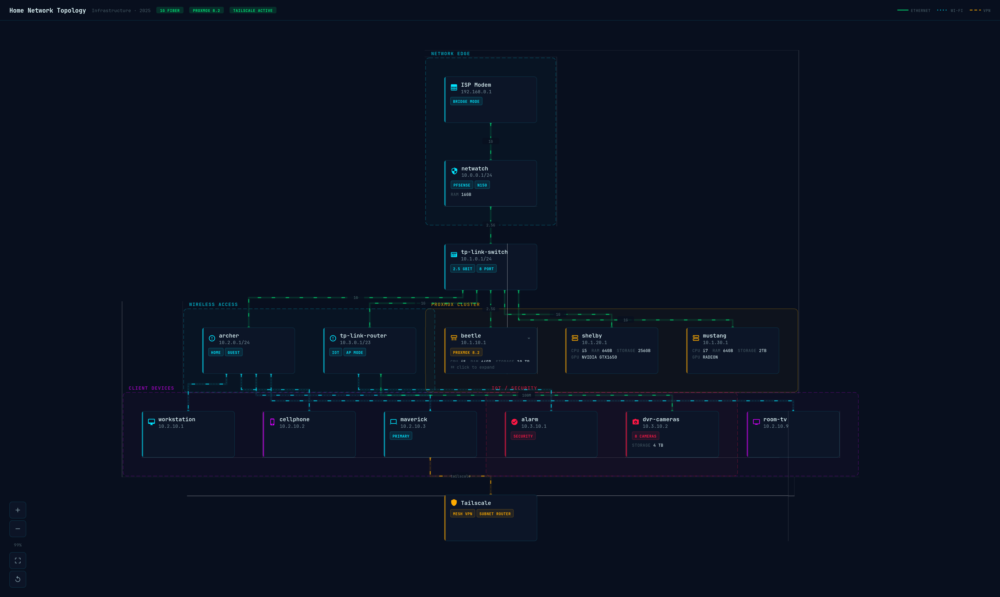

# Homelab StackDoc

A YAML-first homelab documentation tool. Write YAML describing your infrastructure, get a live interactive topology diagram.



## Table of Contents

- [Table of Contents](#table-of-contents)
  - [About the Project](#about-the-project)
  - [Project Status](#project-status)
  - [Getting Started](#getting-started)
    - [Dependencies](#dependencies)
    - [Technology Stack](#technology-stack)
    - [Third-party Services](#third-party-services)
  - [Installation & Development](#installation--development)
    - [Setting Up](#setting-up)
    - [Development](#development)
    - [Testing](#testing)
  - [How to Get Help](#how-to-get-help)
  - [Contributing](#contributing)
  - [Authors](#authors)
    <!-- - [Repo Activity](#repo-activity) -->

## About the Project

Homelab StackDoc lets you document your homelab infrastructure as YAML and renders it as an interactive network topology diagram. Instead of dragging boxes in draw.io or
Visio, you write a config file that describes your devices, connections, and network layout — and the tool handles the visualization.

**Key features:**

- **YAML-first** — your infrastructure is defined in a single, readable config file. Version it, share it, diff it.
- **Live preview** — split-pane editor with syntax highlighting (CodeMirror 6) on the left, interactive topology canvas on the right.
- **Hierarchical expand/collapse** — first view shows only physical devices. Click a hypervisor to reveal its VMs, containers, and services.
- **Animated connections** — ethernet, Wi-Fi, and VPN links rendered with distinct styles and directional flow animation.
- **Group outlines** — visually cluster related devices (Proxmox Cluster, IoT devices, Client Devices, etc.).
- **Share & export** — export as PNG (Reddit-ready), copy YAML to clipboard, or download the config file.
- **Pan, zoom, fit-to-screen** — canvas controls for navigating large topologies.
- **Self-hostable** — ships as a Docker image, runs on your homelab alongside everything else.

The project was inspired by the network topology diagrams shared on [`r/homelab`](https://www.reddit.com/r/homelab/) and [`r/selfhosted`](https://www.reddit.com/r/selfhosted/).

## Project Status

**Current: MVP (v0.1.0)**

The tool is functional and usable for documenting homelab infrastructure. The YAML schema, parser, layout engine, and renderer are all working. Known areas for improvement:

- Layout algorithm could be smarter about group-aware placement
- Multi-node expand in the same row may overlap
- No guided form input mode yet (YAML-only for now)
- Editor could benefit from YAML schema autocompletion

See [open issues](https://github.com/meetKazuki/infra-stackdoc/issues) for planned work.

## Getting Started

### Dependencies

- [Node.js](https://nodejs.org/) `>=20`
- [pnpm](https://pnpm.io/) `>=8`
- [Docker](https://www.docker.com/) (optional, for production builds)

### Technology Stack

| Layer | Technology |
|-------|-----------|
| Language | TypeScript |
| UI Framework | React 18 |
| Build Tool | Vite 5 |
| Editor | CodeMirror 6 |
| Export | html2canvas |
| Containerization | Docker (nginx:alpine) |

**Architecture — monorepo with strict separation of concerns:**

```bash
├── packages/
│   ├── core/           ← Pure TypeScript. Parser, validator, layout engine.
│   │                      Zero DOM/React dependencies. Testable in isolation.
│   └── renderer/       ← React components that paint a PositionedGraph.
│                          Knows nothing about YAML or layout algorithms.
├── apps/
│   └── web/            ← Application shell. Wires core + renderer together.
│                          Split-pane UI: editor left, topology right.
└── Makefile            ← All admin commands in one place.
```

<!-- ### Third-party Services

TBA -->

## Installation & Development

### Setting Up

```bash
# Clone the repository
git clone https://github.com/meetKazuki/infra-stackdoc.git
cd infra-stackdoc

# Install dependencies
make install

# Start the dev server
make dev
```

The dev server starts at `http://localhost:5173`.

### Development

```bash
make dev            # Start Vite dev server with HMR
make typecheck      # Run TypeScript checks across all packages
make build          # Production build
make preview        # Serve the production build locally
make tree           # Show project structure
make loc            # Count lines of source code
make clean          # Remove all build artifacts and node_modules
```

Run `make help` to see all available commands.

### Production Build

```bash
make build
make preview        # Verify at http://localhost:4173
```

### Docker

```bash
make docker-build   # Build the image
make docker-run     # Run on port 8080
make docker-stop    # Stop and remove the container
make docker-restart # Rebuild and restart
make docker-logs    # Tail container logs
```

Visit `http://localhost:8080` after `make docker-run`.

## YAML Schema

A complete homelab config has five sections:

```yaml
meta:
  title: My Homelab
  subtitle: 2025 Edition
  tags: [PROXMOX, TAILSCALE]

networks:
  - id: lan
    name: LAN
    subnet: 10.1.0.0/24
    dhcp:
      start: 10.1.0.100
      end: 10.1.0.200

groups:
  - id: servers
    name: Server Rack
    style: dashed          # dashed | solid | none
    color: "#ffab00"

devices:
  - id: firewall
    name: pfSense
    type: firewall         # router | switch | firewall | server | hypervisor
                           # vm | container | nas | desktop | laptop | phone
                           # tablet | camera | tv | iot | ap | modem | vpn
    ip: 10.0.0.1
    network: lan
    group: servers
    tags: [PFSENSE]
    specs:
      cpu: i5
      ram: 16GB
      storage: 256GB
      os: pfSense 23.09
    children:              # VMs/containers nested inside a host
      - id: dns-vm
        name: DNS Server
        type: vm
        services:          # services running on a device
          - name: Pi-hole
            port: 53
            runtime: native   # native | docker | podman

connections:
  - from: firewall
    to: main-switch
    type: ethernet         # ethernet | wifi | vpn | usb | thunderbolt | fiber
    speed: 2.5G
    direction: bidirectional  # bidirectional (default) | one-way
    label: uplink
```

See the `docs/examples/` directory for complete sample configurations.

<!-- ### Testing

TBA -->

## How to Get Help

Notice a bug? please open an issue. Need more clarification on any part of the code base? Contact [Desmond Edem](https://github.com/meetKazuki).

## Contributing

Contributions are welcome. To get started:

1. Check [open issues](https://github.com/meetKazuki/infra-stackdoc/issues) or raise a new one describing the bug or feature.
2. Once the approach is agreed upon, fork the repo and create a branch off `develop`.
3. Make your changes, ensuring `make typecheck` and `make build` pass.
4. Open a pull request using the PR template.

Please read the [Code of Conduct](CODE_OF_CONDUCT.md) before contributing.

**[Back to top](#table-of-contents)**

## License

This project is licensed under the [MIT License](LICENSE).

## Authors

- **[Desmond Edem](https://github.com/meetKazuki)**
