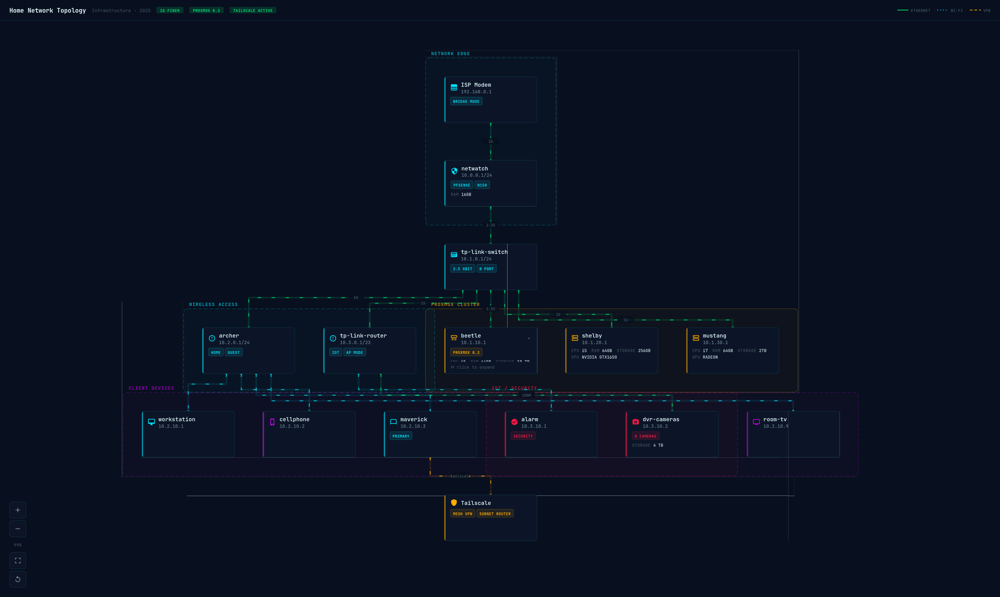

# stackdoc

Document your homelab as YAML. Render it as a live topology.

[](https://github.com/meetKazuki/infra-stackdoc/actions/workflows/ci.yml)
[](https://github.com/meetKazuki/infra-stackdoc/actions/workflows/release.yml)
[](LICENSE)



---

## What it is

stackdoc turns a YAML description of your network and devices into an interactive topology diagram. The diagram updates as you edit. Configs
are plain text — version them, fork them, share them with a link.

It's built for the kind of person who'd rather write `pve-1.ip: 10.0.10.11` than drag a router icon across a Lucidchart canvas. The schema is small.
The renderer handles layout. You handle accuracy.

## Try it

A hosted instance is running at **<https://stackdoc.kazuki.uk>**. Sign in with GitHub to save configs, or use it anonymously to sketch. No registration,
no email, no friction.

If you'd rather run it yourself, see *Quick start* below.

## Why

Drawing tools (Lucidchart, draw.io, Excalidraw) put pixels on a canvas. That works for a sketch, but the canvas isn't a description of your
infrastructure — it's a picture. Picture and reality drift the moment you spin up a new VM.

stackdoc inverts the relationship. The YAML *is* the description. The diagram is generated from it. Update the YAML when reality changes;
the diagram updates with it. The file lives in version control next to the rest of your homelab config.

This is the same logic that won out for documenting APIs (OpenAPI), infrastructure (Terraform), and CI pipelines (GitHub Actions). It
applies just as well to the topology of your basement rack.

## Quick start

```bash
git clone https://github.com/meetKazuki/infra-stackdoc.git
cd infra-stackdoc

make install        # pnpm install across the workspace
make infra          # start Postgres in Docker (one container)
make dev            # start web (5173) and api (3000) in parallel
```

Open <http://localhost:5173>.

### Requirements

- Node.js `>=20`
- pnpm `>=8`
- Docker (for the bundled Postgres; you can also point at any existing Postgres instance via env vars)

## A minimal config

The smallest useful YAML:

```yaml
meta:
  title: Single-Host Docker
  tags: [DOCKER, BEGINNER]

networks:
  - id: lan
    name: Home LAN
    subnet: 192.168.1.0/24

groups:
  - id: edge
    name: Network Edge
    color: "#00e5ff"

devices:
  - id: router
    name: Home Router
    type: router
    ip: 192.168.1.1
    network: lan
    group: edge
    interfaces:
      ethernet:
        count: 5
        speed: 1G
        ports:
          - { label: WAN }
          - { label: LAN1 }
          - { label: LAN2 }
          - { label: LAN3 }
          - { label: LAN4 }

  - id: docker-host
    name: docker-host
    type: server
    ip: 192.168.1.10
    network: lan
    services:
      - name: Jellyfin
        port: 8096
        runtime: docker

connections:
  - from: router
    to: docker-host
    fromPort: LAN1
    type: ethernet
    speed: 2.5G
```

This is one of the seeded templates. Four others (Proxmox cluster, NAS-centric, Tailscale-distributed, k3s cluster) ship with the app
and are discoverable from the *Templates* page.

## Schema reference

The full schema lives in
[`packages/core/src/types.ts`](packages/core/src/types.ts).

Top-level sections:

- **`meta`** — title, subtitle, tags, last-updated timestamp.
- **`networks`** — named L2/L3 segments with subnets and optional VLANs.
- **`groups`** — visual clusters. Can be nested (`parent: <group-id>`).
- **`devices`** — the things on your network. Each device has a `type` (router, server, hypervisor, container, nas, laptop, etc.), an `ip`,
  a `network`, optional `group`, and optional `interfaces`, `services`, `specs`, `tags`, `children`.
- **`connections`** — edges between devices. Can reference labelled ports (`fromPort: WAN`), be bundled into LAGs (`bundle: nas-lag`),
  and carry a type (`ethernet`, `wifi`, `vpn`, `fiber`, `usb`, `thunderbolt`).

Validation runs on every edit. Errors and warnings appear in the editor's status bar with paths into the YAML (e.g. `devices[3].interfaces.ethernet.count`).

## Features

- Hierarchical groups with nesting up to three levels deep.
- Labelled ports (`WAN`, `LAN1`, `SFP+ 1`) shown on each device's port strip.
- Parallel-link bundles (LAGs) collapsed to a single trunk in the render.
- Live validation with error paths into the YAML.
- Density toolbar — toggle ETH / WIFI / VPN / STORAGE layers independently.
- Focus mode (`F` key) — dim non-neighbours of a selected node. Second `F` extends to 2-hop.
- Minimap with click-to-recentre and drag-to-pan.
- Public sharing — every saved config gets a URL at `/s/<slug>`.
- Forking — duplicate any public config into your own account.
- PNG export, copy-YAML, download-YAML, all from a single share panel.
- Templates and a gallery of community configs, browsable without signing in.

## Architecture

stackdoc is a pnpm monorepo with strict layer boundaries.

```
packages/
├── core/        Pure TypeScript. Parser, validator, layout engine, port enumeration, group nesting. Zero DOM/React. Has tests.
└── renderer/    React components that paint a PositionedGraph. Knows nothing about YAML or layout algorithms.

apps/
├── api/         NestJS + TypeORM + Postgres. Auth, configs, gallery, templates, sharing.
└── web/         Vite + React. The editor, gallery, templates pages, landing page. Wires core + renderer together.
```

The `core` package is the brain. It accepts YAML and produces a `PositionedGraph` — typed positions for every node, edge, and group.
The renderer is the face. It accepts a `PositionedGraph` and paints it. Neither knows anything about the other's domain.

This separation matters because layout decisions are testable-in-isolation, and the renderer can be reused (or replaced)without
rewriting the schema.

## Known limitations and what's coming

This is a working tool that powers a hosted instance, but it's not finished. Some honest gaps:

- **Auth is GitHub-only.** Email/password is on the wishlist; we'll add it if it is requested enough.
- **No live device-status integration.** The diagrams describe your homelab; they don't reflect runtime state. A lightweight
agent that pulls reachability or container health into the rendered LED is planned but not started.
- **No in-editor YAML autocomplete or schema squiggles.** Errors appear in the status bar with paths, but the editor doesn't yet
  surface them inline.
- **The layout engine isn't perfect.** Large topologies with many cross-cluster connections can produce edge crossings that a hand-
  drawn layout would avoid.

Track these (and propose more) on the [issues page](https://github.com/meetKazuki/infra-stackdoc/issues).

## Contributing

PRs are welcome. The fastest path:

1. Open an issue describing the bug or feature so we can agree on the approach before code is written.
2. Fork, branch off `develop`, make your changes.
3. Ensure `make typecheck`, `make build`, and `make test` are green.
4. Open a PR.

If you'd like to add a starter template, the YAML files live at `apps/api/src/database/seeders/templates/` with sidecar JSON
metadata. Each template is verified against the parser and layout engine before merge.

The codebase tries to keep `packages/core` pure, the renderer presentational, and the app layer thin. Changes that respect those
boundaries get reviewed faster.

Code of Conduct: [`CODE_OF_CONDUCT.md`](CODE_OF_CONDUCT.md).

## License

MIT — see [LICENSE](LICENSE).

## Acknowledgements

The project was inspired by the topology diagrams shared on [r/homelab](https://www.reddit.com/r/homelab/) and [r/selfhosted](https://www.reddit.com/r/selfhosted/),
where one well- formatted hand-drawn diagram routinely outdraws ten Helm charts.

**Author:** [Desmond Edem](https://github.com/meetKazuki).
